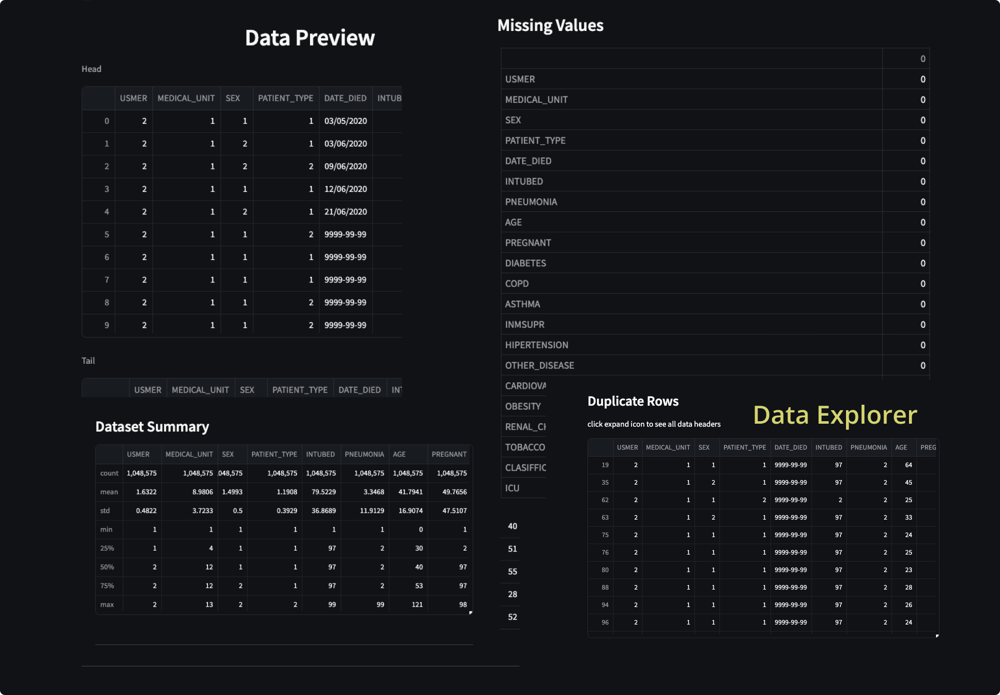

# 
Explore Data 🔬

## Intro & App Functionalities

 

I've developed a Streamlit Python app that performs various data exploration operations on an uploaded dataset. The app offers the following functionalities:

 

1. Dataset Preview: It provides a preview of the first few rows (Head) and last few rows (Tail) of the dataset.

2. Header Count: The app displays the total number of headers (fields or columns) present in the dataset.

3. Row Count: It shows the total number of rows in the dataset.

4. Total Data Points: The app calculates and presents the total number of data points in the dataset, considering all rows and columns.

5. Dataframe Dimension Count: It provides the dimensions (rows and columns) of the dataset.

6. Dataset Size: The app indicates the size of the dataset in terms of memory usage.

7. List of Headers: It displays a list of all headers (fields or columns) available in the dataset.

8. Data Types: For each header, the app presents the corresponding data type (e.g., integer, string, float, etc.).

9. Data Summary Table: The app generates a summary table for headers with numerical values, providing statistics such as mean, median, minimum, maximum, etc.

10. Missing Values Count: It calculates and presents the total number of missing values in the dataset.

11. Duplicate Rows: The app identifies and provides a list of duplicate rows in the dataset.

 

## Why a quick data exploration is important

 

As a data practitioner encompassing roles such as Data Scientist, Data Engineer, or Data Analyst, meticulous data exploration assumes paramount significance in formulating effective strategies and refining pertinent inquiries. This allows you to ask better questions about the data and propose solutions on how to tackle the objectives set by the stakeholders, or raise concerns about the data (too many missing values, data integrity, data errors, sample size, fat-tails or etc...).

 

## Leverage App

 

On average quick data exploration like this will take a couple of mintues or even hours. This app generates a quick summary of the information you need before diving deeper into the data 🙃 

if you cloned the repo you can use test file in project root `banks.csv`

Happy Coding!

 

## Setup

- `streamlit run app.py`

 

 

## Vist Demo App:  👉 [Data Explorer](https://dataexplorer.streamlit.app/)

 

 

## App Updates 🎉

- 9/2/23, increased datasize from 400MB to 1GB with new streamlit update, new ui changes (dataframe -> tables, dark-mode, wide-mode)